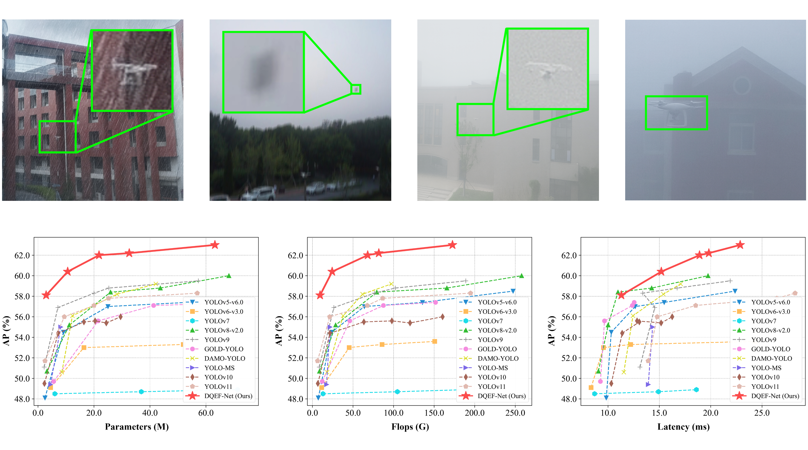

<h1> 
  <p align=center> ESE-Det: Edge Structure Enhanced Detector for Real-time Drone Detection </p>
<div align="center">


[](README.md)

</div>
</h1>



## DataSet  
<table>
  <thead align="center">
    <tr>
      <th>Database</th>
      <th>Description</th>
      <th>Train Images</th>
      <th>Val Images</th>
      <th>Test Images</th>
      <th>BaiduYun Download</th>
      <th>Google Download</th>
    </tr>
  </thead>
  <tbody align="center">
    <tr>
      <td>DUT-Adv</td>
      <td align="left">Augments <a href="https://github.com/wangdongdut/DUT-Anti-UAV">DUT-Anti-UAV</a> dataset with real-world degradations such as rain, fog, and motion blur that reduce contrast and obscure target edges.</td>
      <td>5,200</td>
      <td>1,600</td>
      <td>1,200</td>
      <td><a href="https://pan.baidu.com/s/16m355KcTOcj8NBVUPGcY5w">link</a></td>
      <td>---</td>
    </tr>
    <tr>
      <td>DUT-Plus</td>
      <td align="left">Extends <a href="https://github.com/wangdongdut/DUT-Anti-UAV">DUT-Anti-UAV</a> dataset with multi-target scenes and distractors (birds, aircraft) as hard negatives to reduce false positives.</td>
      <td>7,000</td>
      <td>4,000</td>
      <td>3,000</td>
      <td><a href="https://pan.baidu.com/s/16m355KcTOcj8NBVUPGcY5w">link</a></td>
      <td>---</td>
    </tr>
    <tr>
      <td><a href="https://github.com/Jake-WU/Det-Fly">Det-Fly</a></td>
      <td align="left">Contains over 13,000 high-resolution 4K aerial images. Long-range imaging causes targets to occupy &lt;5% of image area, reducing discriminative features.</td>
      <td>7,962</td>
      <td>2,654</td>
      <td>2,654</td>
      <td>---</td>
      <td>---</td>
    </tr>
  </tbody>
</table>


## Model Zoo  

<table>
  <thead align="center">
    <tr>
      <th>Model</th>
      <th>Resolution</th>
      <th>Epoch</th>
      <th>Params(M)</th>
      <th>FLOPs(G)</th>
      <th>$AP$</th>
      <th>$AP_{50}$</th>
      <th>$AP_{75}$</th>
      <th>BaiduYun Download</th>
      <th>Google Download</th>
    </tr>
  </thead>
  <tbody align="center">
    <tr>
      <td>DQEF-Net-T</td>
      <td>640</td>
      <td>200</td>
      <td>2.9</td>
      <td>9.4</td>
      <td>58.1</td>
      <td>89.4</td>
      <td>66.4</td>
      <td><a href="https://pan.baidu.com/s/1pFTLUklIknTazA3jgNc7Kg?pwd=5xhd">weight</a></td>
      <td>---</td>
    </tr>
    <tr>
      <td>DQEF-Net-S</td>
      <td>640</td>
      <td>200</td>
      <td>10.6</td>
      <td>24.3</td>
      <td>60.4</td>
      <td>91.7</td>
      <td>68.8</td>
      <td><a href="https://pan.baidu.com/s/1VQZyIhzROvzcFNuSndo2Hg?pwd=esm9">weight</a></td>
      <td>---</td>
    </tr>
    <tr>
      <td>DQEF-Net-M</td>
      <td>640</td>
      <td>200</td>
      <td>21.8</td>
      <td>68.1</td>
      <td>62.0</td>
      <td>92.6</td>
      <td>70.8</td>
      <td><a href="https://pan.baidu.com/s/10M4eFKtz-xpWRoZvpqoXLg?pwd=4irr">weight</a></td>
      <td>---</td>
    </tr>
    <tr>
      <td>DQEF-Net-L</td>
      <td>640</td>
      <td>200</td>
      <td>32.6</td>
      <td>81.6</td>
      <td>62.2</td>
      <td>92.7</td>
      <td>71.7</td>
      <td><a href="https://pan.baidu.com/s/1pp2OKEsAdtOH95TPffYayw?pwd=r2jd">weight</a></td>
      <td>---</td>
    </tr>
    <tr>
      <td>DQEF-Net-X</td>
      <td>640</td>
      <td>200</td>
      <td>65.2</td>
      <td>172.6</td>
      <td>63.0</td>
      <td>93.2</td>
      <td>72.2</td>
      <td><a href="https://pan.baidu.com/s/19_H5r_AC-o1FOLpbKV4frA?pwd=8bh8">weight</a></td>
      <td>---</td>
    </tr>
  </tbody>
</table>

- Results of the mAP are evaluated on the DUT-Plus dataset with an input resolution of 640×640.
- All models are trained without using pretrained weights.


## Dependencies and Installation 

1. Clone and enter the repo.

   ```shell
   git clone https://github.com/wanq501/DQEF-Net.git
   cd DQEF-Net
   ```

2. Install dependencies

   ```shell
   pip install -e .
   ```

## Training and Evaluation 

1. Training


   ```shell
   python tools/train.py
   ```


2. Evaluation

   ```shell
   python tools/val.py
   ```


3. Test

   ```shell
   python tools/test.py
   ```

4. Detect

   ```shell
   python tools/detect.py
   ```

- Note: Each script includes detailed instructions on how to set parameters and use the script properly.


## Code  
The code will be made public shortly after the acceptance of the paper.


## Citation

If you find our repo useful for your research, please cite us:

```


```

This project is based on the open source codebase [YOLO (Ultralytics)](https://github.com/ultralytics).

```
@misc{YOLOv11,
  author={Glenn Jocher and Ayush Chaurasia and Jing Qiu},
  title={YOLOv11 by Ultralytics},
  version={11.0.0},
  year={2025},
  month={jan},
  license={AGPL-3.0},
  url={https://github.com/ultralytics/ultralytics}
}
```


This project utilizes the [DUT-Anti-UAV](https://github.com/wangdongdut/DUT-Anti-UAV) dataset to create new augmented datasets for training and evaluation.

```
@article{Dut-Anti-UAV,
  title={Vision-Based Anti-UAV Detection and Tracking},
  author={Jie Zhao and Jingshu Zhang and Dongdong Li and D. Wang},
  journal={IEEE Transactions on Intelligent Transportation Systems},
  year={2022},
  volume={23},
  pages={25323-25334}
}
```


This project also utilizes the [Det-Fly](https://github.com/Jake-WU/Det-Fly) dataset for training and evaluation.

```
@article{Det-Fly,
  title={Air-to-Air Visual Detection of Micro-UAVs: An Experimental Evaluation of Deep Learning},
  author={Ye Zheng and Zhang Chen and Dailin Lv and Zhixing Li and Zhenzhong Lan and Shiyu Zhao},
  journal={IEEE Robotics and Automation Letters},
  year={2021},
  volume={6},
  pages={1020-1027}
}
```